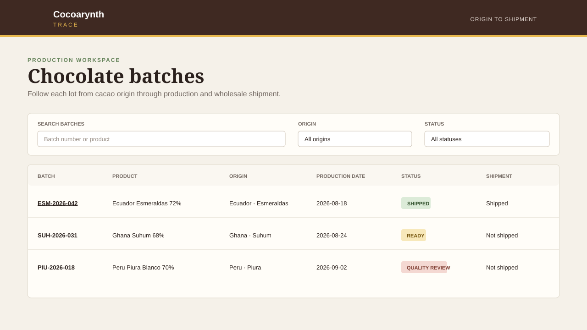

# Cocoarynth Trace


Cocoarynth Trace is an internal operations application for following
single-origin chocolate from cacao harvest through production and wholesale
shipment. It generates an Origin Passport that captures approved traceability
details for each shipped batch.



## Features

- Browse, search, and filter chocolate production batches by origin and status.
- Review product, producer, harvest, certification, production, and shipment
  details.
- Follow a batch from roasting through packaging on a production timeline.
- Preview and download an immutable Origin Passport for shipped batches.
- Export only approved partner-facing fields while keeping supplier contacts,
  negotiated prices, quality notes, operators, and production notes internal.

Origin Passports are currently available as **JSON downloads**. CSV export is
planned work and is not implemented.

## Local setup

Requires a current Node.js LTS release.

```bash
npm install
npm run dev
```

The application opens at `http://localhost:5173` and proxies API requests to the
Express server at `http://localhost:3001`.

## Scripts

| Command | Purpose |
| --- | --- |
| `npm run dev` | Start the Vite frontend and Express API |
| `npm run build` | Build the frontend and compile the server |
| `npm run test` | Run service, API, and focused UI tests |
| `npm run lint` | Run ESLint |
| `npm run format` | Format the repository with Prettier |

## Architecture

- `src/` contains the React operations interface.
- `server/` contains the Express API, deterministic fixtures, and domain
  services.
- `shared/` contains TypeScript types used across the application.
- `tests/` contains service, route, and UI behavior tests.

The Origin Passport service creates a new plain object from an explicit
allowlist of fields. It never serializes internal origin, batch, shipment, or
production-event records. The download endpoint is:

```text
GET /api/batches/:batchId/passport
```

Shipped batches return `application/json` with an
`origin-passport-<batch-number>.json` attachment filename. Unknown batches
return `404`, and unshipped batches return `409`.

## Fictional data

Cocoarynth, its products, companies, people, customers, and operational records
in this repository are entirely fictional and provided for demonstration
purposes.

## License

Licensed under the [MIT License](LICENSE).
